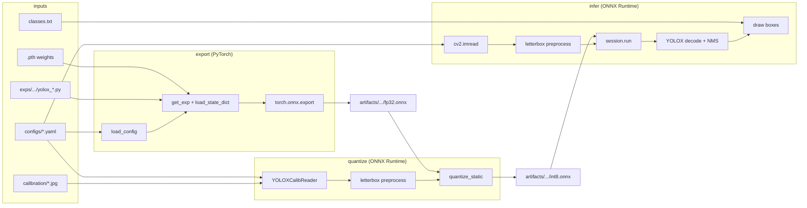

# Post Training Quantization(Static)

Static quantization means calculating the quantization parameters (Scale and Zero-point) before inference, using a calibration dataset. 

Regardless of whether you use Eager, FX, or PT2E, the underlying math and process of converting float32 to int8 remain the same

First clone the offical repo from the official [YOLOX repository](https://github.com/Megvii-BaseDetection/YOLOX) for the full environment setup
## User Guide

1. Exporting to ONNX
First, ensure your pre-trained YOLOX model is exported to ONNX format using the provided experiment file.

```python
# Standard YOLOX ONNX export (adjust based on your actual export script location)
python tools/export_onnx.py --output-name best_ckpt.onnx -f model/yolox_voc_s3.py -c best_ckpt.pth
```
2. INT8 Quantization
Navigate to the model/ directory and run the quantization script. This step typically requires a calibration dataset to compute the quantization parameters.
create a folder and add sample data (200-500) from Training data.

```python
cd model
# Example command - adjust arguments based on your script
python quantize_int8.py --input best_ckpt.onnx --output yolox_int8.onnx
```
3. Evaluation
To ensure the quantized INT8 model maintains acceptable accuracy and bounding box precision, run the evaluation script:

```python
Bash
python eval_onnx_map.py -f yolox_voc_s3.py -m yolox_int8.onnx
```

4. Inference
Use the scripts in the inf/ folder to run accelerated inference using the quantized model.

```python
cd ../inf
# Example command
python inference.py --model ../model/yolox_int8.onnx --image path/to/test_image.jpg --classes ../model/classes.txt
```
=======
# YOLOX static quantization workspace

End-to-end pipeline per model:

**`.pth` checkpoint → FP32 ONNX → static INT8 ONNX → inference**

Each model (dock, gate, …) is driven by one YAML config that points at the exp file, weights, class names, and calibration images.

---

## Repository layout

```
Quant/
├── configs/<model>.yaml       # paths + hyperparameters for one model
├── exps/<model>/              # YOLOX Exp (architecture, num_classes, training hooks)
├── models/<model>/
│   ├── classes.txt            # one label per line (inference + exp)
│   └── weights/               # PyTorch checkpoint (.pth)
├── calibration/<model>/       # images for static quant (not used at export)
├── artifacts/<model>/         # generated fp32.onnx, int8.onnx, infer_*.jpg
├── lib/                       # shared config, preprocess, postprocess, calib reader
└── scripts/                   # export_fp32, quantize_static, infer, run (CLI)
```

---

## Pipeline overview



| Stage | Script | Preprocess? | Postprocess? | What gets loaded |
|-------|--------|-------------|--------------|------------------|
| **export** | `scripts/export_fp32.py` | No (random dummy tensor) | No (raw head output stays in graph) | YAML config, `.pth`, YOLOX exp |
| **quantize** | `scripts/quantize_static.py` | Yes (`lib/preprocess.py`) | No | YAML, FP32 ONNX, cal image paths |
| **infer** | `scripts/infer.py` | Yes (`lib/preprocess.py`) | Yes (`lib/yolox_postprocess.py`) | YAML, ONNX, test image, `classes.txt` |

---

## Configuration and path resolution

**File:** `lib/config.py`

Every command starts by loading the model YAML:

```bash
python scripts/run.py --config configs/dock.yaml <command>
```

`load_config()`:

1. Parses the YAML with `yaml.safe_load`.
2. Resolves relative paths against the **repo root** (`Quant/`).
3. Creates `output_dir` if missing (default: `artifacts/<model_name>/`).
4. Sets output ONNX paths unless overridden:
   - `fp32_onnx` → `artifacts/<model>/fp32.onnx`
   - `int8_onnx` → `artifacts/<model>/int8.onnx`
5. Applies defaults: `input_size=640`, `opset=11`, `max_calib_images=100`, `conf_thres=0.25`, `nms_thres=0.45`.

Class names for inference are loaded separately via `load_class_names(classes_path)` — one non-empty line per class from `models/<model>/classes.txt`.

### Config keys

| Key | Used in | Description |
|-----|---------|-------------|
| `model_name` | all | Logical name; defaults to YAML filename stem |
| `exp_file` | export | YOLOX experiment Python module |
| `weights` | export | PyTorch checkpoint (`.pth`) |
| `classes` | infer | Label file for visualization / logging |
| `calibration_dir` | quantize | Folder of images for activation calibration |
| `output_dir` | all | Artifact directory |
| `fp32_onnx` / `int8_onnx` | quantize, infer | ONNX file paths |
| `input_size` | quantize, infer | Letterbox side length (default 640) |
| `opset` | export | ONNX opset version |
| `max_calib_images` | quantize | Max images fed to calibrator |
| `conf_thres` / `nms_thres` | infer | Detection thresholds |

The exp file (`exps/<model>/`) reads the **same** `models/<model>/classes.txt` to set `num_classes` at training/export time. Keep `exps/<model>/` folder name aligned with `models/<model>/` (e.g. both `dock`, both `gate`).

---

## Stage 1: Export (`.pth` → FP32 ONNX)

**Entry:** `scripts/export_fp32.py` or `python scripts/run.py --config ... export`

### What is loaded

| Source | Loader | Purpose |
|--------|--------|---------|
| `configs/*.yaml` | `lib.config.load_config` | Paths and `input_size` / `opset` |
| `weights` (`.pth`) | `torch.load(..., map_location="cpu")` | Uses `ckpt["model"]` if present, else full state dict |
| `exp_file` | `yolox.exp.get_exp(exp_file, None)` | Builds network (`depth`, `width`, `num_classes`, …) |

### Preprocessing

**None on real images.** Export traces the model with a **random** tensor:

```text
shape: (1, 3, H, W)   # H, W from exp.test_size or config input_size
dtype: float32
```

Real-image letterboxing is **not** part of the ONNX graph. It always runs in Python before `session.run` (calibration and inference).

### Postprocessing

**Not in the ONNX graph.** Before export:

```python
model.head.decode_in_inference = False
```

So the exported model outputs **raw YOLOX head tensors** (per-anchor predictions). Grid decoding, box scaling, and NMS run in Python in `lib/yolox_postprocess.py` during inference only.

### ONNX I/O contract

| Name | Shape | Notes |
|------|-------|-------|
| Input `images` | `1 × 3 × 640 × 640` | NCHW, float32, BGR order as uint8→float (no `/255` in current preprocess) |
| Output `output` | `1 × N × (5 + num_classes)` | N = total anchors across strides 8/16/32 |

---

## Stage 2: Static quantization (FP32 ONNX → INT8 ONNX)

**Entry:** `scripts/quantize_static.py` or `python scripts/run.py --config ... quantize`

### What is loaded

| Source | Loader | Purpose |
|--------|--------|---------|
| `fp32_onnx` | `onnxruntime.InferenceSession` | Read input tensor name for calibration |
| `calibration_dir` | `YOLOXCalibReader` in `lib/calib_reader.py` | Image paths only (lazy read per batch) |

### Calibration data loading (`lib/calib_reader.py`)

`YOLOXCalibReader` implements ONNX Runtime’s `CalibrationDataReader`:

1. **Discovery:** `glob` on `calibration/<model>/` for `*.jpg`, `*.jpeg`, `*.png`, `*.bmp`.
2. **Ordering:** Sorted alphabetically, truncated to `max_calib_images` (default 100).
3. **Iteration:** `get_next()` returns one sample at a time until exhausted:
   - Read path → `letterbox_blob(path)` → dict `{input_name: blob}`.
   - Skip unreadable images and continue.

ORT runs the FP32 model on each blob, records activation ranges (MinMax), then inserts QDQ nodes for static INT8.

### Preprocessing (calibration)

**File:** `lib/preprocess.py` → `letterbox_blob(img_path, input_size)`

Same logic as inference (see below). Calibration and inference **must** use identical preprocessing or INT8 accuracy drops.

### Postprocessing

None during quantization.

### Quantization settings (`scripts/quantize_static.py`)

- Format: `QuantFormat.QDQ`
- Activations & weights: `QInt8`
- Calibration: `CalibrationMethod.MinMax`
- `per_channel=False`

---

## Stage 3: Inference (ONNX → detections → image)

**Entry:** `scripts/infer.py` or `python scripts/run.py --config ... infer --image <path>`

### What is loaded

| Source | Loader | Purpose |
|--------|--------|---------|
| Config YAML | `load_config` | Paths, `input_size`, thresholds |
| `fp32.onnx` or `int8.onnx` | `onnxruntime.InferenceSession` | Forward pass |
| Test image | `cv2.imread(image)` | BGR `H×W×3` |
| `classes.txt` | `load_class_names` | String label per class id |

### Full inference data flow

```text
  disk image                    ONNX model                 detections
      │                              │                          │
      ▼                              │                          │
 cv2.imread ──► letterbox_with_ratio │                          │
      │              │               │                          │
      │         blob (1,3,640,640)   │                          │
      │         ratio (scale)        │                          │
      │              └──────────────► session.run ──► raw output │
      │                                              │           │
      │                                              ▼           │
      │                                    postprocess(ratio) ───┘
      │                                              │
      │                                              ▼
      └──────────────────────────────────► draw on original image
```

### Preprocessing (`lib/preprocess.py`)

Used by **calibration** (`letterbox_blob`) and **inference** (`letterbox_with_ratio`).

**Letterbox steps** (YOLOX-style, matches training val transform):

1. Compute scale `ratio = min(input_size/h, input_size/w)` (preserve aspect ratio).
2. Resize image to `(new_w, new_h)`.
3. Pad into `input_size × input_size` canvas filled with **114** (gray), top-left aligned.
4. `HWC → CHW`, add batch dim → shape `(1, 3, 640, 640)`.
5. Cast to **`float32`** (pixel values 0–255, not normalized to 0–1).

`letterbox_with_ratio` also returns `ratio` so boxes can be mapped back to the **original image coordinates** after postprocess.

### ONNX forward

```python
outputs = session.run(None, {input_name: blob})
# outputs[0] shape: (1, num_anchors, 5 + num_classes)
```

No decoding inside the graph (because of `decode_in_inference = False` at export).

### Postprocessing (`lib/yolox_postprocess.py`)

All decoding happens **after** `session.run` in Python.

**Step 1 — Grid decode** (strides 8, 16, 32):

- Build anchor grids for each FPN level.
- Convert offsets to absolute box centers/sizes in letterboxed space:
  - `xy = (pred_xy + grid) * stride`
  - `wh = exp(pred_wh) * stride`

**Step 2 — Scores**

- `objectness × class_probability` per anchor and class.

**Step 3 — Boxes**

- Convert center format to **xyxy**.
- Divide by `ratio` to undo letterbox scale → coordinates on the **original** `cv2.imread` image.

**Step 4 — NMS**

- Per-class thresholding with `conf_thres`.
- `cv2.dnn.NMSBoxes` with `nms_thres`.
- Each detection: `[x1, y1, x2, y2, score, class_id]`.

**Step 5 — Visualization** (`scripts/infer.py`)

- Lookup `class_names[int(cls_id)]`.
- Draw rectangles and labels on a copy of the source image.
- Default save path: `artifacts/<model>/infer_<fp32|int8>_<stem>.jpg`.

---

## Where logic lives (quick reference)

| Concern | Module | Functions / classes |
|---------|--------|---------------------|
| Config & paths | `lib/config.py` | `load_config`, `load_class_names` |
| Letterbox preprocess | `lib/preprocess.py` | `letterbox_blob`, `letterbox_with_ratio` |
| Cal image iterator | `lib/calib_reader.py` | `YOLOXCalibReader` |
| Decode + NMS | `lib/yolox_postprocess.py` | `postprocess`, `multiclass_nms` |
| Export | `scripts/export_fp32.py` | `export_fp32` |
| Static quant | `scripts/quantize_static.py` | `quantize` |
| Inference | `scripts/infer.py` | `infer` |
| CLI wrapper | `scripts/run.py` | `export` \| `quantize` \| `infer` \| `all` |
| Model architecture | `exps/<model>/yolox_*.py` | YOLOX `Exp` subclass |

---

## Quick start

### Dock

```bash
# 1. Place files
#    models/dock/weights/best_ckpt.pth
#    calibration/dock/*.jpg   (100+ diverse images recommended)

# 2. Export
python scripts/run.py --config configs/dock.yaml export

# 3. Quantize
python scripts/run.py --config configs/dock.yaml quantize

# Or both:
python scripts/run.py --config configs/dock.yaml all

# 4. Infer
python scripts/run.py --config configs/dock.yaml infer \
  --image /path/to/test.jpg --model int8
```

### Gate (or any new model)

1. Copy/adjust `configs/gate.yaml`.
2. Add `exps/gate/yolox_*.py` — match `depth`, `width`, epochs to training.
3. Add `models/gate/classes.txt` and `models/gate/weights/best_ckpt.pth`.
4. Add calibration images under `calibration/gate/`.
5. Run with `--config configs/gate.yaml`.

---

## Important consistency notes

1. **Same preprocess everywhere:** Calibration (`letterbox_blob`) and inference (`letterbox_with_ratio`) share `lib/preprocess.py`. Do not change one without the other.
2. **Decode is outside ONNX:** If you re-export with `decode_in_inference = True`, you must remove or change `lib/yolox_postprocess.py` accordingly.
3. **Class count:** `len(classes.txt)` must match `num_classes` in the exp and the trained checkpoint.
4. **Cal images:** Use real deployment-like scenes; MinMax ranges depend on the tensors produced by the same letterbox pipeline.

---

## Dependencies

```bash
pip install -r requirements.txt
```

Requires **YOLOX** installed in the same environment for the export step (`yolox.exp.get_exp`).

---

## Legacy scripts

Older scripts under `model/` and `inf/` are deprecated. Use `scripts/run.py` and `configs/*.yaml` instead.

